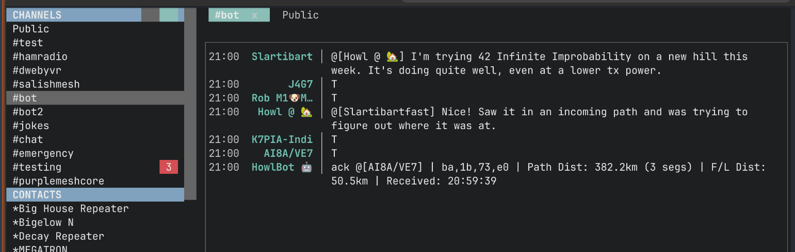

# MeshRC

A [Textual](https://textual.textualize.io)-based TUI for MeshCore,
providing an IRC-like interface for [MeshCore](https://meshcore.co.uk)
devices.



## Features

- **IRC-like Interface**: Split view with Sidebar (Channels/Contacts) and Main Chat.
- **Real-time Updates**: Live message reception and unread badges.
- **Multi-protocol**: Support for Serial, TCP, and BLE connections.

## Installation

Requires Python 3.14+

```bash
# Create venv and install
python3.14 -m venv venv
source venv/bin/activate
pip install .
```

## Usage

Run the client specifying the connection method:

### Serial (Default)
```bash
python -m meshrc --serial /dev/ttyUSB0
```

### TCP
```bash
python -m meshrc --target localhost --port 4403
```

### BLE
```bash
python -m meshrc --address <DEVICE_ADDRESS>
```

## Options
| Option                 | Description                     |
|------------------------|---------------------------------|
|-h, --help              | show this help message and exit |
|-s, --serial SERIAL     | Serial port (e.g. /dev/ttyUSB0) |
|-b, --baudrate BAUDRATE | Baud rate for serial connection |
|-t, --target TARGET     | TCP host (e.g. localhost)       |
|-p, --port PORT         | TCP port                        |
|-a, --address ADDRESS   | BLE device address              |
|--log LOG               | Log file path (JSON format)     |

## Controls

- **Tab**: Switch focus
- **Ctrl+S**: Open Settings
- **Ctrl+Q**: Quit

## History

This project was inspired by [meshcore-cli](https://github.com/meshcore/meshcore-cli).
The TUI is derived from my earlier abandoned project that attempted to implement a
similar app using Go and Bubble Tea.
